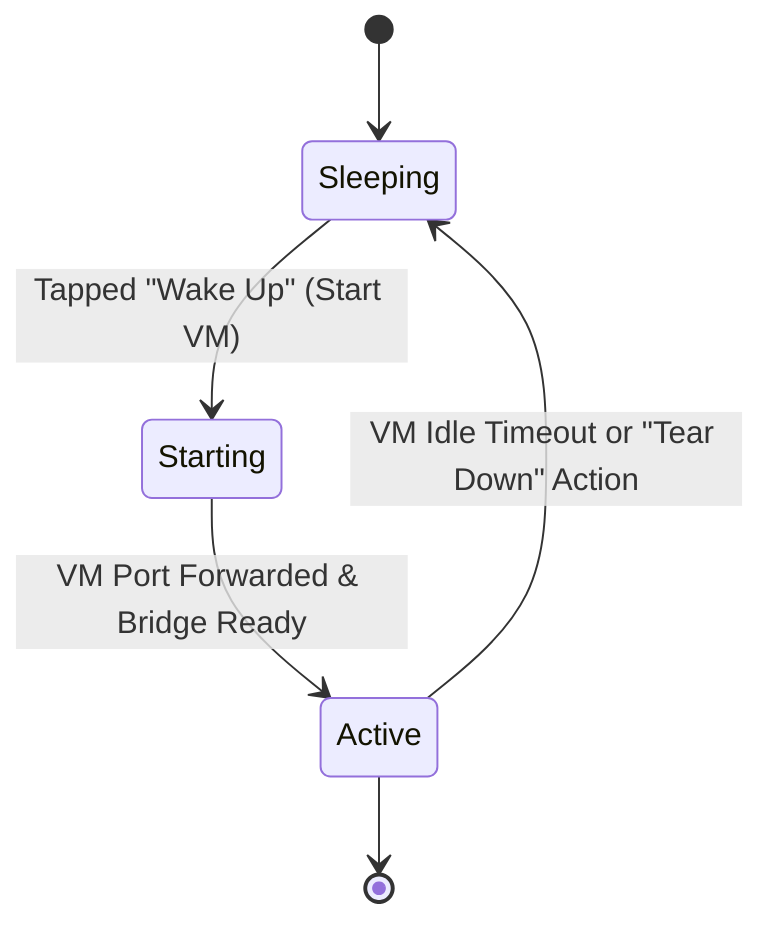
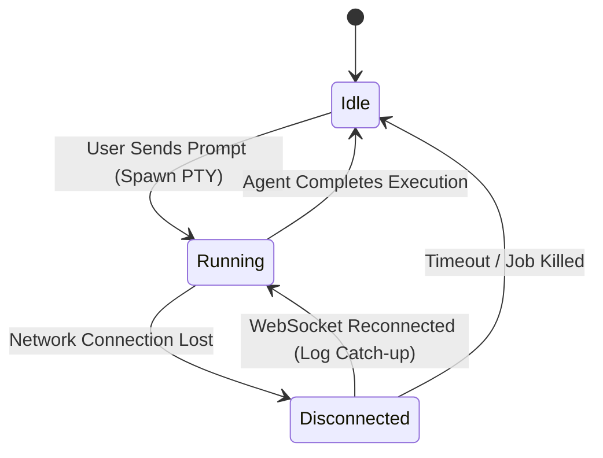

# Data Model: IOTA Platform

This document describes the key entities, fields, relationships, and state transitions within the IOTA mobile application and bridge server.

---

## 1. Core Entities

### UserSession (Mobile Client Local State)
Represents the authenticated developer session. This is kept entirely client-side.
- **Fields**:
  - `githubToken`: String (Secret) - OAuth access token for GitHub API.
  - `username`: String - GitHub handle (e.g., `sunilbishnoi1`).
  - `avatarUrl`: String (URL) - Profile photo.
  - `apiKeys`: Map<String, String> - Key-value map of third-party API keys (e.g., `ANTHROPIC_API_KEY`, `OPENAI_API_KEY`). Stored securely.
- **Relationships**:
  - Has many `CodespaceVM` instances fetched via GitHub API.

### CodespaceVM (Bridge Server & GitHub API State)
Represents a GitHub Codespace instance.
- **Fields**:
  - `id`: String - Unique identifier (Codespace Name, e.g., `ideal-space-123`).
  - `repositoryName`: String - Name of repository (e.g., `sunilbishnoi1/IdeaPilot`).
  - `branchName`: String - Currently active git branch (e.g., `main`).
  - `status`: Enum (`"sleeping" | "starting" | "active" | "stopping"`) - VM status.
  - `freeHoursRemaining`: Decimal - Remaining free monthly hours (e.g., `12.0`).
  - `connectionUrl`: String (WSS URL) - The forwarded port URL for connection.
- **Relationships**:
  - Belongs to `UserSession`.
  - Has one active `TerminalSession` when running.

### TerminalSession (Bridge Server Process State)
Represents a pseudo-terminal execution instance spawned on the Codespace VM.
- **Fields**:
  - `sessionId`: String (UUID) - Unique socket session identifier.
  - `processId`: Integer - PID of the spawned shell (`node-pty`).
  - `status`: Enum (`"idle" | "running" | "disconnected"`) - Execution status.
  - `logBuffer`: String - Rolling buffer containing the last 2000 lines of console output (including ANSI escape codes).
- **Relationships**:
  - Spawns one shell process.
  - Belongs to one `CodespaceVM`.

### FileDiff (Bridge Git Integration State)
Represents changes made to a file by the CLI agent.
- **Fields**:
  - `filePath`: String - Path of the modified file relative to repository root.
  - `hunks`: List<DiffHunk> - List of changes inside the file.
  - `additions`: Integer - Number of lines added.
  - `deletions`: Integer - Number of lines removed.

---

## 2. State Transitions

### Codespace VM Lifecycle

### Terminal Session Lifecycle

---

## 3. Data Validation Rules

1. **GitHub OAuth Token**: Must be a valid 40-character alphanumeric string or OAuth2 token prefix (`gho_`).
2. **API Keys**: Validate format:
   - `ANTHROPIC_API_KEY`: Must start with `sk-ant-` and match expected key length.
   - `OPENAI_API_KEY`: Must start with `sk-` and match expected key length.
3. **Monthly Hours**: Must be a non-negative decimal between `0.0` and `60.0`.
4. **Git Branch Name**: Must conform to standard git ref name rules.
