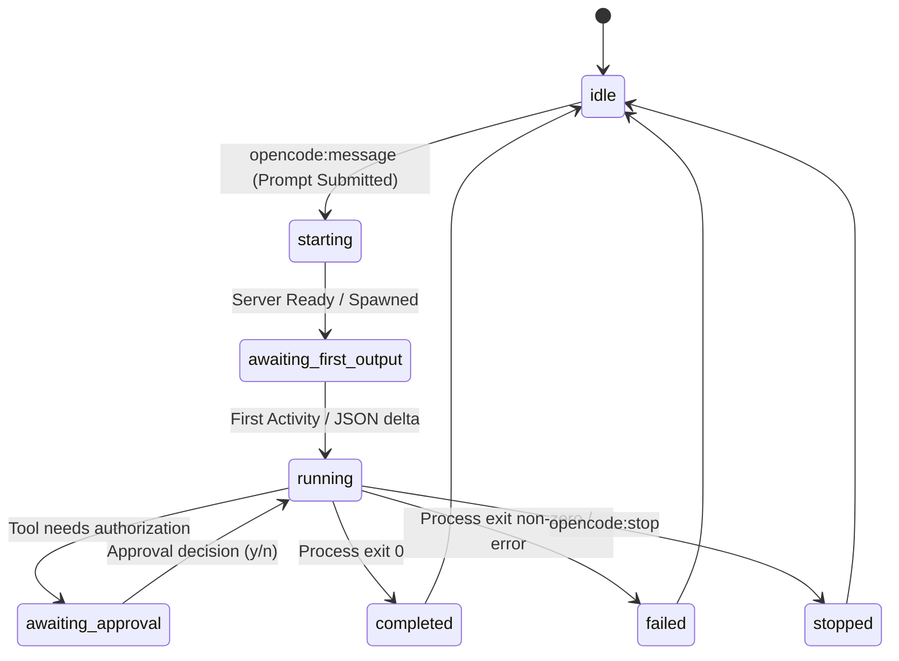

# Data Model: OpenCode Control Chat Fixes

This document details the data structures, validations, and transitions utilized by the OpenCode integration.

## Entities

### 1. OpenCodeMessage
Represents a message bubble or status block in the chat timeline.

| Field | Type | Description |
|---|---|---|
| `id` | `string` | Unique message identifier. Status messages use a stable ID: `run-${requestId}`. |
| `conversationId` | `string` | ID of the conversation this message belongs to. |
| `role` | `'user' \| 'assistant' \| 'status' \| 'system'` | Role of the message sender. |
| `content` | `string` | The text content of the message. |
| `createdAt` | `string` | ISO 8601 timestamp. |
| `status` | `'pending' \| 'streaming' \| 'complete' \| 'error' \| 'stopped'` | Current state of the message. |
| `metadata` | `object` | Optional metadata (e.g. `phase`, `requestId`, `retryable` for status roles). |

---

### 2. OpenCodeConversation
Represents a full conversation session with OpenCode, stored in-memory on the bridge (`opencodeStore`).

| Field | Type | Description |
|---|---|---|
| `id` | `string` | Conversation identifier (e.g. `opencode-${codespaceId}`). |
| `opencodeSessionId` | `string` | The actual OpenCode daemon/CLI session ID. |
| `status` | `'idle' \| 'starting' \| 'running' \| 'awaiting_first_output' \| 'awaiting_approval' \| 'completed' \| 'failed' \| 'stopped'` | Current state of the session. |
| `messages` | `OpenCodeMessage[]` | Ordered list of messages. |
| `tools` | `OpenCodeToolActivity[]` | Active tool logs. |
| `fileChanges` | `OpenCodeFileChange[]` | File changes produced during the run. |
| `approvals` | `OpenCodeApprovalRequest[]` | Actions pending user authorization. |
| `activeRequestId` | `string \| undefined` | ID of the current active run request. |
| `lastRunPhase` | `string \| undefined` | Last recorded run status phase. |
| `lastError` | `string \| undefined` | Summary of the last encountered error. |

---

## State Transitions

