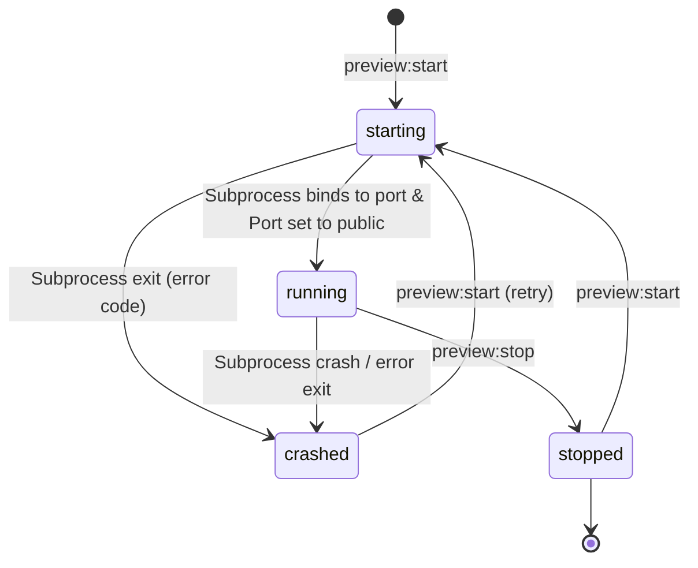

# Data Model: Preview Support

This document details the configuration structures and process states managed by the preview engine.

---

## 1. Workspace Preview Configuration Model

Persisted in the workspace under `.iota/preview.json`. This stores the declarative setup for starting the preview servers.

```json
{
  "$schema": "http://json-schema.org/draft-07/schema#",
  "title": "PreviewWorkspaceConfig",
  "type": "object",
  "properties": {
    "servers": {
      "type": "array",
      "items": {
        "$ref": "#/definitions/PreviewServerConfig"
      }
    }
  },
  "required": ["servers"],
  "definitions": {
    "PreviewServerConfig": {
      "type": "object",
      "properties": {
        "name": {
          "type": "string",
          "description": "User-friendly name of the preview target (e.g. Expo App, Admin Web)"
        },
        "cwd": {
          "type": "string",
          "description": "Working directory path relative to workspace root (defaults to '.')"
        },
        "command": {
          "type": "string",
          "description": "Command line instruction to launch the preview server (e.g. 'npx expo start')"
        },
        "port": {
          "type": "integer",
          "description": "Port number the preview server binds to (e.g. 8081, 5173)"
        },
        "type": {
          "type": "string",
          "enum": ["expo-go", "web"],
          "description": "The preview UI renderer to load on the mobile client"
        }
      },
      "required": ["name", "command", "port", "type"]
    }
  }
}
```

---

## 2. In-Memory Process State Model

Maintained on the bridge server in a dynamic status registry mapping port numbers to process states.

### Entity: `PreviewProcessState`

| Field | Type | Description |
| :--- | :--- | :--- |
| `port` | `number` | Port number serving as the primary identifier. |
| `pid` | `number \| null` | Process ID of the spawned background subprocess (null if inactive). |
| `status` | `'starting' \| 'running' \| 'stopped' \| 'crashed'` | Current execution lifecycle status. |
| `command` | `string` | The command used to launch the server. |
| `url` | `string` | Resolved public forwarded URL (e.g. `https://<codespace>-8081.app.github.dev`). |

### State Transitions


