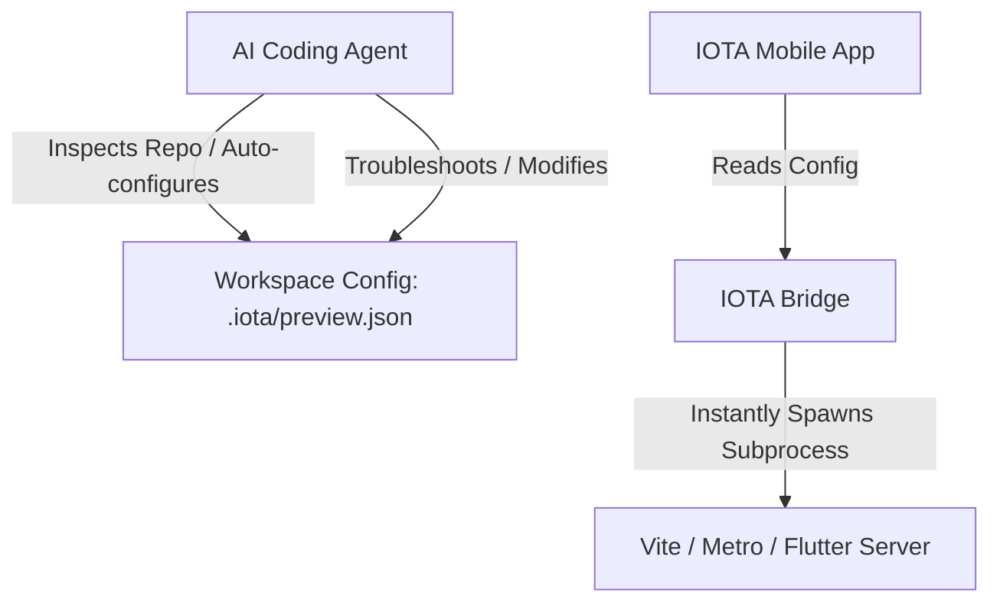

# Implementation Plan: Inbuilt React Native Expo Go & Web Preview Support

**Branch**: `008-preview-support` | **Date**: 2026-06-28 | **Spec**: [spec.md](file:///d:/Desktop/codes/IOTA/specs/008-preview-support/spec.md)

**Input**: Feature specification from `/specs/008-preview-support/spec.md`

**Note**: This template is filled in by the `/speckit-plan` command. See `.specify/templates/plan-template.md` for the execution workflow.

## Summary

The goal of this feature is to enable developers using the IOTA mobile application to preview their active workspaces directly on their devices. This is achieved by separating **Configuration (the Brain)** from **Execution (the Brawn)**:



- **Agent-Defined Configuration (The Brain)**: The AI agent inspects the repository and auto-configures/writes a declarative configuration file at `.iota/preview.json`. If the repository layout or port changes, the agent updates this file automatically.
- **Bridge-Executed Process Spawning (The Brawn)**: The bridge reads `.iota/preview.json` to find the launch commands, working directories (`cwd`), and target ports, then spawns the processes instantly using standard Node.js subprocess rules.
- **Client Renderers**: 
  - For Expo/React Native projects, the client displays a QR code and an "Open in Expo Go" deep-link button mapping to `exps://<codespace-domain>-8081.app.github.dev`.
  - For Web projects (Vite, Next.js, static HTML, Flutter Web), the client renders an embedded browser WebView pointing to the forwarded public URL.
- **Log Streaming**: The bridge streams subprocess stdout/stderr logs in real-time via WebSockets to a collapsible terminal log pane.

## Technical Context

**Language/Version**: Node.js v18+, TypeScript, React Native v0.72+ (Expo SDK 49+)

**Primary Dependencies**: `react-native-webview` (for web previewing), `react-native-qrcode-svg` or equivalent (for rendering QR codes), Socket.io (for WebSocket communications), GitHub CLI `gh` (for toggling port visibility)

**Storage**: Configuration persisted in the remote workspace configuration file at `.iota/preview.json`

**Testing**: Jest and Supertest (for bridge tests), Jest and React Native Testing Library (for mobile client tests)

**Target Platform**: GitHub Codespaces (Linux VM) for backend, iOS & Android devices for mobile client

**Project Type**: Mobile Client (React Native/Expo) + Remote Bridge (Node.js/Express/Socket.io)

**Performance Goals**:
- Start remote preview process and resolve public URL within 5 seconds (SC-001)
- Trigger deep link to Expo Go on device in under 1 second (SC-002)
- Recompile/hot-reload on file change within 3 seconds (SC-003)
- Kill/terminate remote preview server processes within 1 second of stopping (SC-004)

**Constraints**:
- Must follow Node.js subprocess rules (Unix vs Windows compatibility) when spawning child processes
- Security: Port must be toggled to `public` to allow device access, but should be managed safely (stopped on exit/explicit termination)
- Live log streaming must be virtualized or limited to prevent JS thread bottleneck

**Scale/Scope**: Single developer preview instance per workspace. Supports running multiple custom/dynamic servers (Multi-Port Ready) since the configuration file defines an array of servers.

## Constitution Check

*GATE: Must pass before Phase 0 research. Re-check after Phase 1 design.*

| Principle / Section | Requirement | Compliance Status | Rationale |
| :--- | :--- | :--- | :--- |
| **I. Secret Management** | No secrets stored on remote VM. | **PASSED** | The preview configuration and state do not store or persist any user secrets (like GitHub tokens or LLM keys) on disk. |
| **II. Mobile Optimization** | 60 FPS rendering, virtualized lists for large logs. | **PASSED** | The mobile client log console will be collapsible and use a scroll-optimized/virtualized list to avoid blocking the JS thread. |
| **III. Decoupled Micro-Bridge** | Direct connection via secure WebSockets and REST, no proxy. | **PASSED** | The mobile app connects directly to the `iota-bridge` on the Codespace VM. |
| **IV. Dynamic VM Provisioning** | No manual VM setup required. | **PASSED** | Any required tooling (`gh` CLI, node processes) is standard or checked dynamically. Port visibility is updated via `gh` CLI. |
| **V. Test-First Implementation** | Code must have Jest tests (both bridge and client). | **PASSED** | Detailed unit and integration tests will verify process management, port visibility toggles, and websocket streaming. |

## Project Structure

### Documentation (this feature)

```text
specs/008-preview-support/
├── spec.md              # Feature specification
├── plan.md              # This file
├── research.md          # Phase 0 output
├── data-model.md        # Phase 1 output
├── quickstart.md        # Phase 1 output
└── contracts/           # Phase 1 output (interfaces/contracts)
```

### Source Code (repository root)

```text
iota-bridge/
├── src/
│   ├── services/
│   │   ├── previewService.ts   # NEW: Manages preview subprocesses and port public toggling
│   │   └── socket.ts           # MODIFY: WebSocket listeners for preview events
│   └── types/
│       └── preview.ts          # NEW: Type definitions for preview state and configs
└── tests/
    └── services/
        └── preview.test.ts     # NEW: Bridge-side tests for service launching and teardown

iota-mobile/
├── src/
│   ├── components/
│   │   └── PreviewTerminal.tsx # NEW: Scrollable terminal pane using optimized FlatList
│   ├── screens/
│   │   ├── ControlScreen.tsx   # MODIFY: Entry point navigation to preview
│   │   └── PreviewScreen.tsx   # NEW: WebView, QR code, deep links, and control bar
│   └── services/
│       └── preview.ts          # NEW: WebSocket events connection layer
└── tests/
    └── screens/
        └── PreviewScreen.test.tsx # NEW: Mobile client preview interface tests
```

**Structure Decision**:
Using the standard decoupled Mobile + API structure. `iota-bridge` handles launching/managing process tasks and executing the Codespace CLI. `iota-mobile` handles WebSockets, QR code, Expo Deep Link launcher, and integrated WebView.

## Complexity Tracking

*No violations identified. The architectural decisions fully comply with the IOTA Constitution.*
