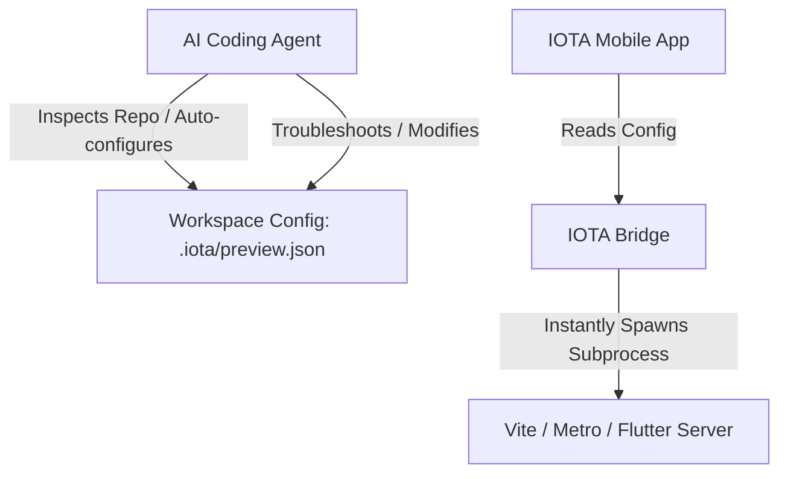

# Technical Research: Inbuilt React Native Expo Go & Web Preview Support

This document details the architectural decisions, research findings, and technical strategies evaluated to support workspace previews on the IOTA platform.

---

## 0. Separation of Configuration (The Brain) and Execution (The Brawn)

### Decision
Architect the preview service around a decoupled pattern where the AI Coding Agent acts as the **Brain** (inspecting the project and writing/updating `.iota/preview.json`), while the IOTA Bridge acts as the **Brawn** (simply executing the commands defined in the configuration without complex heuristics).



- **Workspace Configuration File (`.iota/preview.json`)**: Auto-generated/updated by the AI agent during development and fully customisable by the developer. It defines the workspace's preview configurations (`name`, `cwd`, `command`, `port`, `type`).
- **Bridge Backend**: Exposes a stateless API to spawn or stop processes. When the user requests a preview start, the bridge simply reads the selected configuration block from `.iota/preview.json` and spawns the subprocess.

### Rationale
This decoupling ensures that preview startup is extremely fast, predictable, and deterministic. The bridge remains lightweight and free of brittle framework auto-detection heuristics. If the repository layout changes or a new framework is adopted, the AI Agent updates `.iota/preview.json` accordingly, shielding the runtime bridge and the mobile client code from changes. It also natively supports starting, stopping, and forwarding multiple URLs/ports simultaneously (Multi-Port Ready) since configurations are declared as an array.

---

## 1. Port Visibility and Forwarding in GitHub Codespaces

### Decision
Use the local `gh` CLI wrapper inside the bridge server process to dynamically configure the preview port's visibility to `public`.
```bash
gh codespace ports visibility <port>:public -c <codespace_name>
```

### Rationale
GitHub Codespaces ports are secure and private by default. Accessing a private port requires authenticated session cookies or auth headers. While custom headers can be injected into the initial HTTP request of a React Native WebView, secondary assets (images, fonts, async bundles) requested by the browser do not automatically inherit these headers. Expo Go also lacks the ability to attach authentication tokens/cookies when pulling JS bundles from Metro. Setting port visibility to `public` resolves these authentication issues natively.

### Alternatives Considered
- **OAuth / Cookie Injection**: Rejected because we cannot intercept and inject headers on subresource asset requests in `react-native-webview`, nor can we control Expo Go's asset downloader.
- **Reverse Proxy Tunneling (ngrok, localtunnel)**: Rejected for Phase 1 because GitHub Codespaces provides built-in port-forwarding. Reverse proxy utilities would introduce additional external dependencies, require account registration/tokens, and increase latency.

---

## 2. Port Collision Resolution

### Decision
Before spawning any preview dev server, the bridge will identify and automatically kill any process currently listening on the requested port using shell commands.
- **Unix**: `fuser -k <port>/tcp` or `lsof -t -i :<port> | xargs kill -9`
- **Windows**: `netstat -ano | findstr :<port>` followed by `taskkill /F /PID <PID>`

### Rationale
If the requested port is already occupied (e.g. from a prior crashed run or another running process), launching the command will fail with `EADDRINUSE`. Automatically killing the blocking process ensures a seamless user experience, avoiding cryptic UI errors.

### Alternatives Considered
- **Port Auto-Incrementing**: Rejected because the mobile client and configuration are bound to a specific port. Changing the port dynamically would require updated configuration settings and deep link mapping, complicating Expo Go bundle retrieval.

---

## 3. Subprocess Management and Lifecycle

### Decision
Adhere strictly to the Node.js subprocess guidelines in [AGENTS.md](file:///d:/Desktop/codes/IOTA/AGENTS.md). Keep a global in-memory registry of running child processes on the bridge (`activePreviews: Map<number, ChildProcess>`). 
- On disconnect of the WebSocket, **do not** terminate the process.
- On explicit `preview:stop` event, call `.kill()` on the child process and toggle port visibility back to `private`.

### Rationale
Developers expect the dev server to remain active even if the mobile app briefly loses network connection or if they switch to another app on their device. Stopping the server on every disconnect would ruin the experience.

### Alternatives Considered
- **Immediate Teardown on Disconnect**: Rejected because mobile networks are transient and will cause frequent brief socket disconnections.
- **Strict Timeout/Heartbeat**: A 10-minute idle worker was considered, but since Codespaces sleep automatically when inactive, we will keep processes alive indefinitely while the Codespace is running, unless stopped explicitly.

---

## 4. Real-time Live Log Streaming

### Decision
Piped `stdout` and `stderr` streams of the spawned subprocess will be emitted to the mobile client in real-time using Socket.io namespaces/events. The mobile client will display logs using a scroll-optimized list view with a toggle to collapse the pane.

### Rationale
Providing the console logs of Metro/Vite is critical for debugging compilation errors, syntax issues, and seeing reload logs.

### Alternatives Considered
- **Log Buffering (Post-Mortem only)**: Only showing logs on crash. Rejected because live feedback is highly valuable for understanding hot-reload progress.
