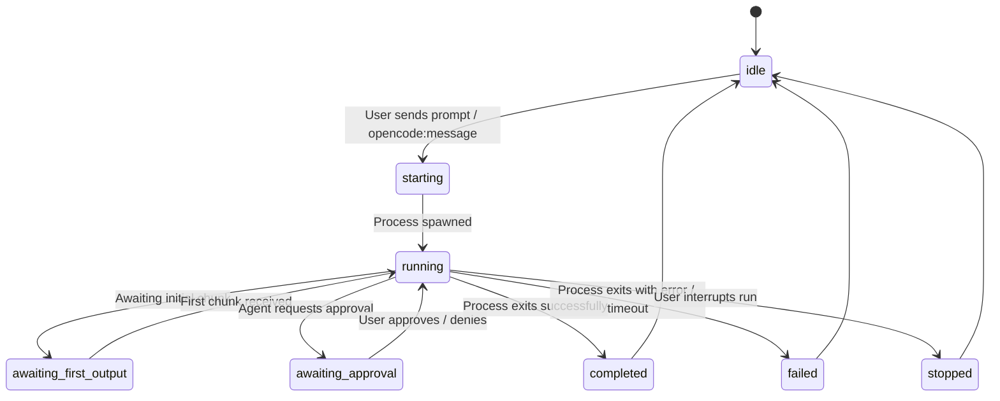

# Data Model: Fix "New Chat" and Add Session Persistence

This document defines the schemas and state transitions for persistent IOTA conversations and mobile caching.

## 1. Entities

### OpenCodeConversation
Represents a single independent chat session, persisted as a JSON file in `.iota/conversations/<id>.json`.

| Field | Type | Description |
| :--- | :--- | :--- |
| `id` | `string` | Unique conversation ID (UUID or custom string like `opencode-<workspaceId>-<timestamp>`). |
| `opencodeSessionId` | `string` | (Optional) The session ID returned by the OpenCode CLI, used to continue active sessions. |
| `title` | `string` | (Optional) Human-readable title, generated automatically from the first user message. |
| `status` | `OpenCodeConversationStatus` | Current operational state of the conversation (e.g. `'idle'`, `'running'`, `'awaiting_approval'`). |
| `messages` | `OpenCodeMessage[]` | Ordered list of messages exchanged in this conversation. |
| `tools` | `OpenCodeToolActivity[]` | History of tool executions (terminal commands, file changes, etc.) run during this session. |
| `fileChanges` | `OpenCodeFileChange[]` | Aggregated list of file modifications made by the agent. |
| `approvals` | `OpenCodeApprovalRequest[]` | Record of user approvals requested and resolved. |
| `createdAt` | `string` | ISO timestamp of conversation creation. |
| `updatedAt` | `string` | ISO timestamp of the last message, tool activity, or state change. |
| `activeRequestId` | `string` | (Optional) Token/request identifier for the active CLI process. |
| `lastRunPhase` | `OpenCodeRunPhase` | (Optional) Phase of the latest execution (e.g., `'preflight'`, `'streaming'`). |
| `lastError` | `string` | (Optional) Summary of any execution errors. |
| `activeModel` | `string` | (Optional) The LLM model assigned to this session (e.g., `'opencode/deepseek-v4-flash-free'`). |

### OpenCodeMessage
Represents a single textual turn in a conversation.

| Field | Type | Description |
| :--- | :--- | :--- |
| `id` | `string` | Unique identifier. |
| `conversationId` | `string` | Foreign key referencing the parent conversation. |
| `role` | `'user' \| 'assistant' \| 'status'` | Role of the message creator. |
| `content` | `string` | Text content or status message payload. |
| `createdAt` | `string` | ISO timestamp. |
| `status` | `'pending' \| 'streaming' \| 'complete' \| 'error' \| 'stopped'` | Operational status of the message. |

---

## 2. State Transitions (Conversation Status)



---

## 3. Mobile Cache Layout (`SecureStore`)

To prevent workspace-wide pollution, local device cache keys are partitioned by both workspace scope and conversation ID.

### Stored Keys:
- **Active Session ID Key**: `iota_active_convo_id_${scope}`
  - *Value*: String (the currently selected conversation ID).
- **Conversation Cache Key**: `iota_chat_cache_${scope}_${conversationId}`
  - *Value*: JSON serialized array of the last 30 messages (chunked automatically if size > 1024 chars):
    ```typescript
    Array<{
      id: string;
      role: 'user' | 'assistant' | 'status';
      content: string;
      created: string;
      status: string;
    }>
    ```
